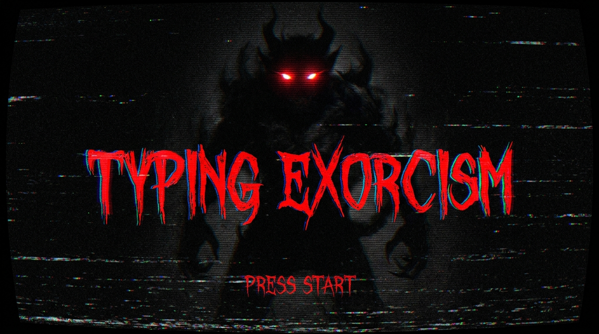

<p align="center">
  
</p>

# 🕯️ Typing Exorcism

**Don't blink. Don't look away. It moves when you're not watching.**

Inspired by the **Weeping Angels** from *Doctor Who* — creatures that can only move when no one is looking at them — *Typing Exorcism* brings that terrifying concept to life using your **real webcam**.

A demon is frozen in the darkness ahead. As long as you're looking at the screen, it can't move. But the moment you glance down at your keyboard, close your eyes, or look away — **it lurches closer**.

Your only hope? Type a Latin exorcism incantation perfectly, from memory, without ever looking away.

---

## 🎮 How to Play

1. **Grant camera access** — the game uses your webcam to track your face in real-time.
2. **Calibrate** — look straight at the screen while the eye tracker locks onto your face.
3. **Begin the ritual** — the Latin incantation appears. Type it character by character.
4. **Don't. Look. Away.** — just like the Weeping Angels, the demon only moves when you're not watching.
5. **Banish it** — finish the incantation before it reaches you.

### The Weeping Angel Rules

> *"Don't blink. Blink and you're dead. Don't turn your back. Don't look away. And most of all, don't blink."*
> — The Doctor

The same rules apply here:

- 👀 **Look away** → the demon moves closer
- 😑 **Close your eyes** → the demon moves closer  
- 👇 **Glance at your keyboard** → the demon moves closer
- 👁️ **Keep watching** → the demon is frozen

The twist? You have to **type an entire Latin incantation without looking at your keys**. Can you touch-type under pressure while a demon creeps toward you?

### ⌨️ Controls

| Key | Action |
|---|---|
| Any letter/symbol | Type the next character of the incantation |
| `Backspace` | Correct a mistyped character (you're locked until you fix it) |
| Your eyes 👀 | **Keep them on the screen. Always.** |

---

## 👹 The Demon

Like a Weeping Angel frozen mid-lunge, it waits in the fog — a dark, spiky shape with pulsing red eyes. The moment you break eye contact, it moves. You'll know it's getting close because:

- The **heartbeat** gets faster and louder
- The **screen glitches** — VHS static, chromatic aberration, tracking errors
- The **camera shakes** violently
- The **threat meter** fills with blood red

If it reaches you: jumpscare. Game over. **You are possessed.**

If you finish the incantation: the demon is banished. Your soul is safe... for now.

---

## 🔍 How It Watches You

The game uses **MediaPipe Face Landmarker** to track three signals from your face in real-time:

| Signal | What it detects |
|---|---|
| **Head pitch** | Are you tilting your head downward? |
| **Eye gaze** | Are your pupils pointing down (even if your head is still)? |
| **Eye closure** | Are your eyes closed or blinking too long? |

Any of these will unfreeze the demon. A real-time telemetry HUD shows you exactly what the tracker sees, with a face mesh overlay drawn on the webcam feed.

> **Pro tip:** The game auto-calibrates to your neutral face position. Sit comfortably and look straight ahead during calibration.

---

## 🚀 Getting Started

```bash
# Clone the repo
git clone https://github.com/manikiran949/gaze-lock-survival.git
cd gaze-lock-survival

# Install dependencies
npm install

# Start the dev server
npm run dev
```

Open `http://localhost:5173` in Chrome (recommended for best webcam + WebGL performance).

### Requirements

- A **webcam** (built-in or external)
- A modern browser with **WebGL** support
- **Chrome** recommended

---

## 🎨 Aesthetic

The entire game is wrapped in a **cursed VHS tape** aesthetic — because nothing says "you're about to be possessed" like a haunted videotape:

- CRT screen curvature and deep vignette
- Scanlines and static noise
- Chromatic aberration that intensifies with danger
- Horizontal glitch/tracking errors
- Blood-red UI with monospace fonts

Everything gets worse as the demon gets closer. By the time it's near, the screen is barely readable.

---

## 🙏 Inspiration

- **Weeping Angels** (*Doctor Who*) — the core "it moves when you're not looking" mechanic
- **SCP-173** — the original "don't break eye contact" horror
- Cursed VHS tapes, exorcism films, and the universal fear of something standing in the dark behind you

---

## 📜 License

MIT
